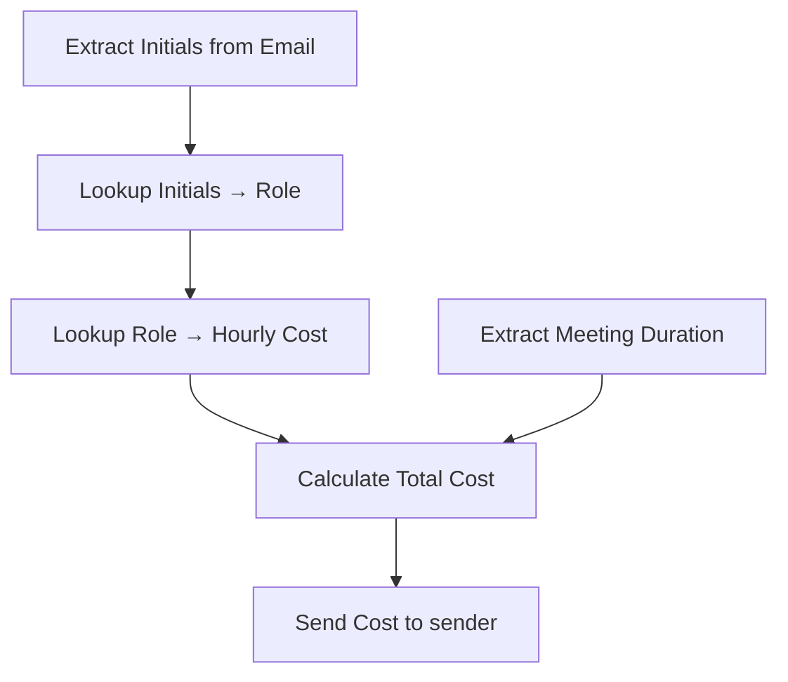

# Meeting Cost Calculation Logic

```mermaid
flowchart TD
    ExtractInitials[Extract Initials from Email]
    InitialsRoles[Lookup Initials → Role]
    RoleCosts[Lookup Role → Hourly Cost]
    Duration[Extract Meeting Duration]
    Calculate[Calculate Total Cost]
    ExtractInitials --> InitialsRoles
    InitialsRoles --> RoleCosts
    RoleCosts --> Calculate
    Duration --> Calculate
    Calculate --> Output[Send Cost to sender]
```
