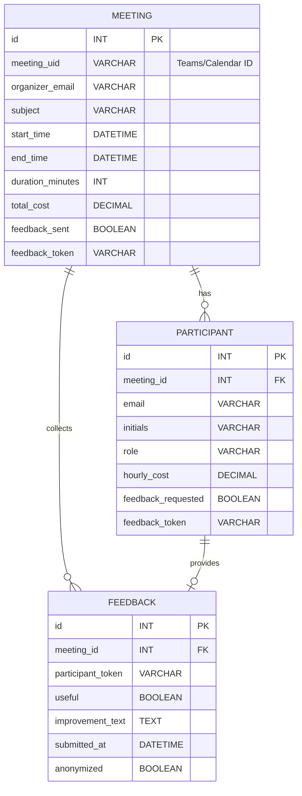

# Database Structure

```mermaid
erDiagram
    MEETING {
        id INT PK
        meeting_uid VARCHAR "Teams/Calendar ID"
        organizer_email VARCHAR
        subject VARCHAR
        start_time DATETIME
        end_time DATETIME
        duration_minutes INT
        total_cost DECIMAL
        feedback_sent BOOLEAN
        feedback_token VARCHAR
    }
    PARTICIPANT {
        id INT PK
        meeting_id INT FK
        email VARCHAR
        initials VARCHAR
        role VARCHAR
        hourly_cost DECIMAL
        feedback_requested BOOLEAN
        feedback_token VARCHAR
    }
    FEEDBACK {
        id INT PK
        meeting_id INT FK
        participant_token VARCHAR
        useful BOOLEAN
        improvement_text TEXT
        submitted_at DATETIME
        anonymized BOOLEAN
    }
    MEETING ||--o{ PARTICIPANT : has
    MEETING ||--o{ FEEDBACK : collects
    PARTICIPANT ||--o| FEEDBACK : provides
```
