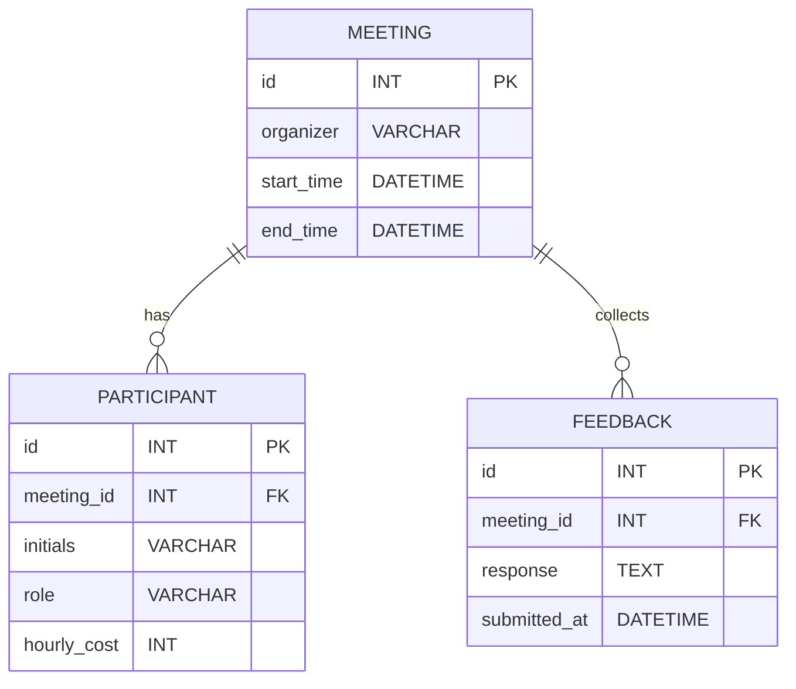

# Database Structure

```mermaid
erDiagram
    MEETING {
        id INT PK
        organizer VARCHAR
        start_time DATETIME
        end_time DATETIME
    }
    PARTICIPANT {
        id INT PK
        meeting_id INT FK
        initials VARCHAR
        role VARCHAR
        hourly_cost INT
    }
    FEEDBACK {
        id INT PK
        meeting_id INT FK
        response TEXT
        submitted_at DATETIME
    }
    MEETING ||--o{ PARTICIPANT : has
    MEETING ||--o{ FEEDBACK : collects
```
