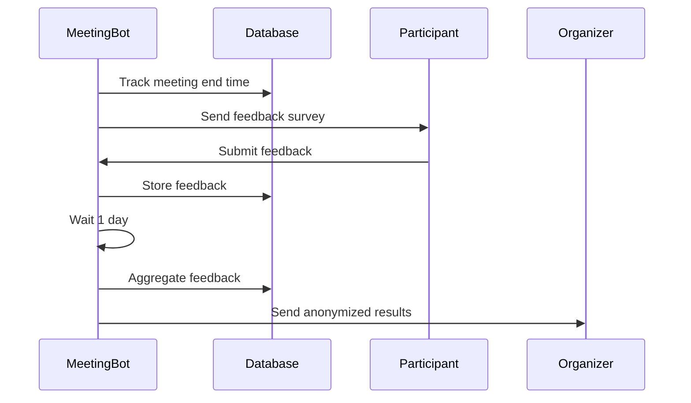

# Feedback Collection and Aggregation Flow

```mermaid
sequenceDiagram
    participant Bot as MeetingBot
    participant DB as Database
    participant User as Participant
    participant Org as Organizer
    Bot->>DB: Track meeting end time
    Bot->>User: Send feedback survey
    User->>Bot: Submit feedback
    Bot->>DB: Store feedback
    Bot->>Bot: Wait 1 day
    Bot->>DB: Aggregate feedback
    Bot->>Org: Send anonymized results
```
