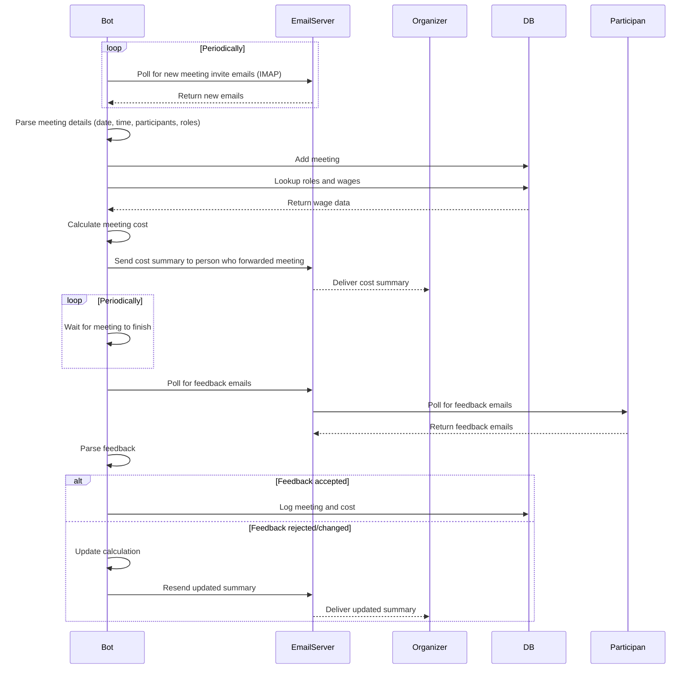

# Meeting Calculator Bot Sequence Diagram (Polling Email Server)

```mermaid
sequenceDiagram
    participant Bot
    participant EmailServer
    participant Organizer
    participant DB
    participant Participan

    loop Periodically
        Bot->>EmailServer: Poll for new meeting invite emails (IMAP)
        EmailServer-->>Bot: Return new emails
    end
    Bot->>Bot: Parse meeting details (date, time, participants, roles)
    Bot->>DB: Add meeting
    Bot->>DB: Lookup roles and wages
    DB-->>Bot: Return wage data
    Bot->>Bot: Calculate meeting cost
    Bot->>EmailServer: Send cost summary to person who forwarded meeting
    EmailServer-->>Organizer: Deliver cost summary
    loop Periodically
        Bot->>Bot: Wait for meeting to finish
    end
    Bot->>EmailServer: Poll for feedback emails
    EmailServer->>Participan: Poll for feedback emails
    Participan-->>EmailServer: Return feedback emails
    Bot->>Bot: Parse feedback
    alt Feedback accepted
        Bot->>DB: Log meeting and cost
    else Feedback rejected/changed
        Bot->>Bot: Update calculation
        Bot->>EmailServer: Resend updated summary
        EmailServer-->>Organizer: Deliver updated summary
    end
```
