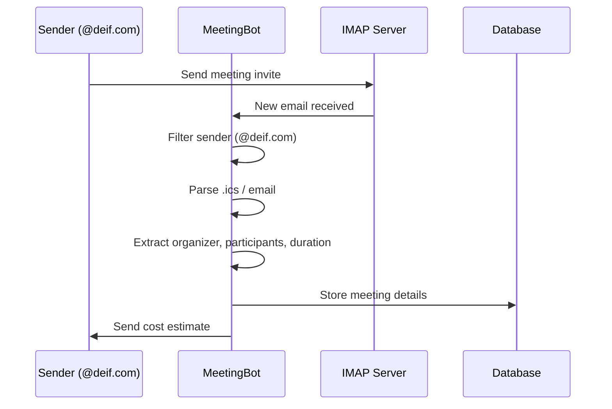

# Meeting Invitation Processing Flow

```mermaid
sequenceDiagram
    participant User as Sender (@deif.com)
    participant Bot as MeetingBot
    participant IMAP as IMAP Server
    participant DB as Database
    User->>IMAP: Send meeting invite
    IMAP->>Bot: New email received
    Bot->>Bot: Filter sender (@deif.com)
    Bot->>Bot: Parse .ics / email
    Bot->>Bot: Extract organizer, participants, duration
    Bot->>DB: Store meeting details
    Bot->>User: Send cost estimate
```
