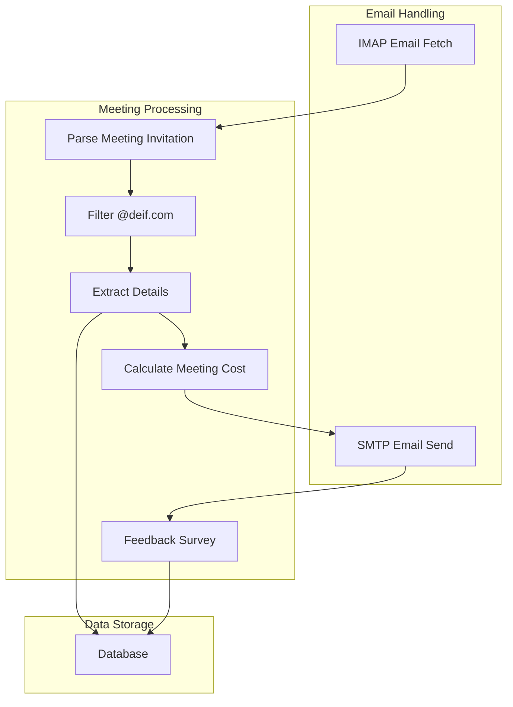

# System Architecture

```mermaid
flowchart TD
    subgraph Email Handling
        IMAP[IMAP Email Fetch]
        SMTP[SMTP Email Send]
    end
    subgraph Meeting Processing
        ParseInvite[Parse Meeting Invitation]
        FilterSender[Filter @deif.com]
        ExtractDetails[Extract Details]
        CostCalc[Calculate Meeting Cost]
        Feedback[Feedback Survey]
    end
    subgraph Data Storage
        MainDB[Database]
    end
    IMAP --> ParseInvite
    ParseInvite --> FilterSender
    FilterSender --> ExtractDetails
    ExtractDetails --> CostCalc
    CostCalc --> SMTP
    ExtractDetails --> MainDB
    Feedback --> MainDB
    SMTP --> Feedback
```
